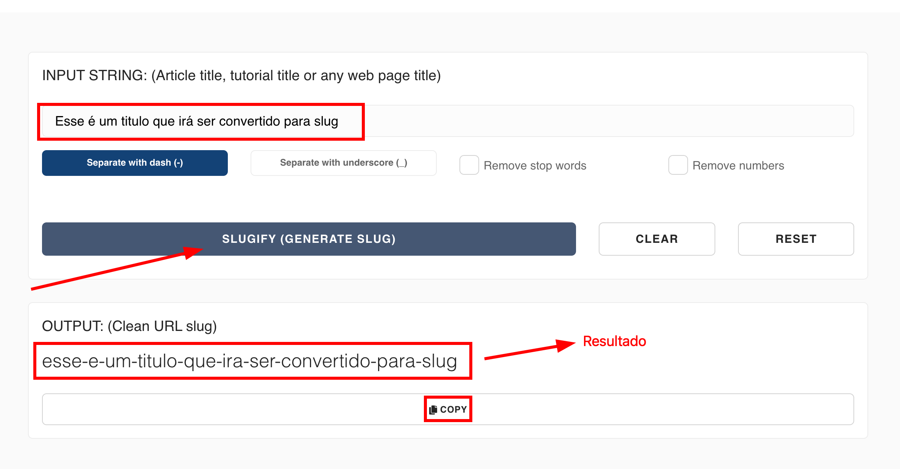

## Termos Genéricos

- [Termos Genéricos](#termos-genéricos)
  - [**Upload**](#upload)
  - [**Download**](#download)
  - [**CMS (Sistema de Gerenciamento de Conteúdo)**](#cms-sistema-de-gerenciamento-de-conteúdo)
  - [**APIs (Interfaces de Programação de Aplicativos)**](#apis-interfaces-de-programação-de-aplicativos)
  - [**FAQ**](#faq)
- [Termos Técnicos](#termos-técnicos)
  - [**Slug**](#slug)
  - [**Modal**](#modal)
  - [**URL**](#url)

### **Upload**

No contexto do desenvolvimento web, "upload" se refere ao processo de transferir dados (arquivos ou outro conteúdo) do dispositivo de um cliente para um servidor. Por exemplo, quando os usuários anexam um arquivo a um e-mail, eles estão fazendo o upload do arquivo para o servidor de e-mail. Da mesma forma, quando os usuários enviam imagens, vídeos ou documentos para um site ou aplicativo, eles estão enviando esses arquivos para o servidor para armazenamento ou processamento.

### **Download**

"Download" é o oposto de upload. Refere-se ao processo de transferir dados de um servidor para o dispositivo de um cliente. Quando os usuários clicam em um link para baixar um arquivo ou quando eles recuperam conteúdo de um site, eles estão iniciando um processo de download, onde os dados são buscados do servidor e salvos em seu dispositivo local.

### **CMS (Sistema de Gerenciamento de Conteúdo)**

Um Sistema de Gerenciamento de Conteúdo (CMS) é um aplicativo de software que permite aos usuários criar, gerenciar e publicar conteúdo digital facilmente. Plataformas de CMS fornecem uma interface intuitiva, muitas vezes com um editor visual, o que permite que usuários sem conhecimentos técnicos adicionem e modifiquem conteúdo em sites, blogs ou aplicativos sem a necessidade de habilidades de codificação. Plataformas CMS populares incluem WordPress, Joomla, Drupal, entre outros.

### **APIs (Interfaces de Programação de Aplicativos)**

Uma API é um conjunto de regras e protocolos que permite que diferentes aplicativos de software se comuniquem e interajam entre si. APIs definem como funcionalidades ou dados específicos podem ser acessados e utilizados pelos desenvolvedores. Elas servem como uma ponte entre diferentes sistemas de software, permitindo que eles trabalhem juntos e troquem informações de forma transparente.

### **FAQ**

FAQ é a sigla para "Frequently Asked Questions" ou, em português, "Perguntas Frequentes". É uma seção comum em sites, aplicativos e documentações que reúne uma lista de perguntas que são feitas com frequência pelos usuários ou visitantes e suas respectivas respostas.

## Termos Técnicos

1. [**Slug**](#slug)
2. [**Modal**](#modal)
3. [**URL**](#url)

### **Slug**

Caso você não esteja familiarizado com slugs, essa palavra pode ser um pouco estranha, mas o slug serve como um identificador para a página que seja conciso e mais legível por uma pessoa.

Para gerar um slug a partir de um texto, você pode usar [esse site](https://slugify.online/) no qual converte textos para formatação de slug.

### **Modal**

Um modal é uma pequena janela ou caixa de diálogo que aparece na frente do conteúdo principal de uma página da web ou aplicativo. Ele é usado para exibir informações adicionais, solicitar ações do usuário ou fornecer uma interação específica, enquanto mantém o contexto da página subjacente.

### **URL**

Uma URL (Uniform Resource Locator) é um endereço que identifica um recurso específico na internet. É uma sequência de caracteres que descreve onde um recurso pode ser encontrado e como ele pode ser acessado.

Uma URL geralmente começa com um esquema, como "http://" ou "https://", seguido pelo nome de domínio, que é o endereço do servidor onde o recurso está localizado. Em seguida, pode haver um caminho para especificar o diretório ou a localização exata do recurso na estrutura do servidor. Além disso, as URLs podem conter parâmetros ou consultas que fornecem informações adicionais ao servidor.

Por exemplo, a URL "https://www.example.com/page1" aponta para a página da web chamada "page1" no site "example.com" usando o protocolo seguro "https". Essa URL direciona o navegador para a página desejada no servidor da web específico.