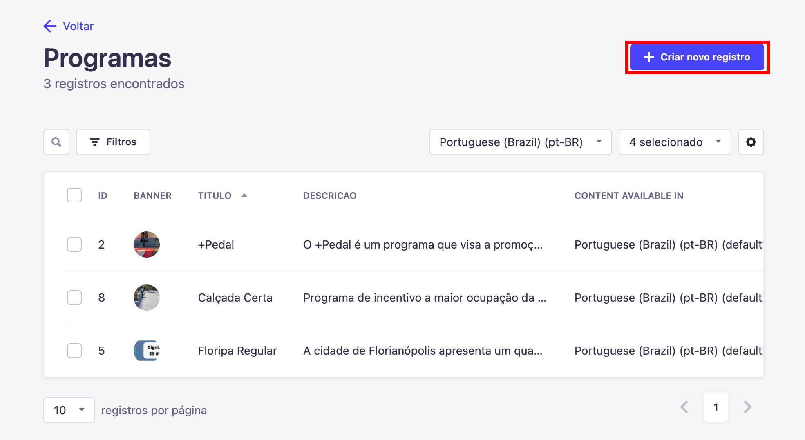
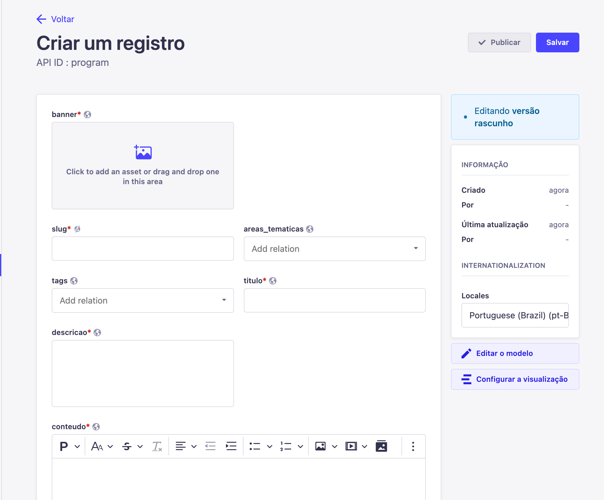
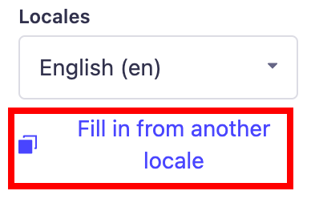

---

title: Criando um Conteúdo
description: Criando um conteúdo
sidebar_position: 2

---

### Preenchendo campos

Agora, dentro de uma coleção, basta clicar em `"Criar novo registro"`

Após clicar no botão, uma nova aba se abrirá mostrando os campos que devem ser preenchidos.

Existem campos obrigatórios(estão marcados com um "*" no nome) e campos opcionais. Os campos opcionais devem ser preenchidos a partir do objetivo final da criação do conteúdo e cabe a você decidir o que precisará ou não.

### Relacionamentos

Existem campos que se relacionam com outras coleções, na coleção de programas, por exemplo, mostrada na imagem acima, existe o campo `"areas_tematicas"` no qual você pode selecionar 1 ou mais áreas temáticas no qual o conteúdo pertence, porém, para selecionar uma área temática, é necessário ter criado uma pelo menos. 

Esse conceito continua para todas outras coleções na qual possui relacionamentos, você precisará criar um para poder selecionar.

### Internacionalização

Dependendo da coleção, você terá a opção de traduzir seu conteúdo, isso é muito importante para tornar o conteúdo acessível para todos. Você irá saber se um campo necessita ou não de tradução quando no menu lateral direito da criação ou edição do conteúdo tiver um botão com nome "Locales".

### Copiando internacionalização

**Mesmo que você não vá gerar uma tradução no momento para o conteúdo, crie o mesmo conteúdo na outra linguagem sem alterar os textos. É importante ter todos os conteúdos em todas linguagens disponíveis mesmo que ainda não haja a tradução no momento.**

Para fazer isso, basta entrar em um conteúdo após a criação do mesmo e no momento da edição, selecionar a linguagem desejada através do menu lateral na direita, por exemplo **"English (en)"**, clicar no botão escrito  `"Fill in from another locale"` e selecionar a linguagem no qual você deseja copiar para o conteúdo atual e confirmar clicando em `"Yes, fill in"`.

