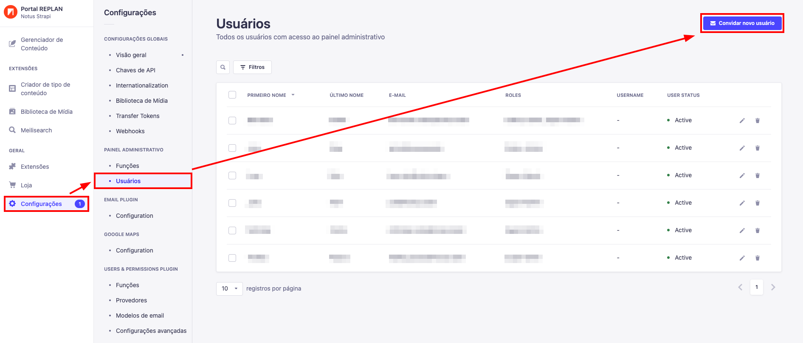
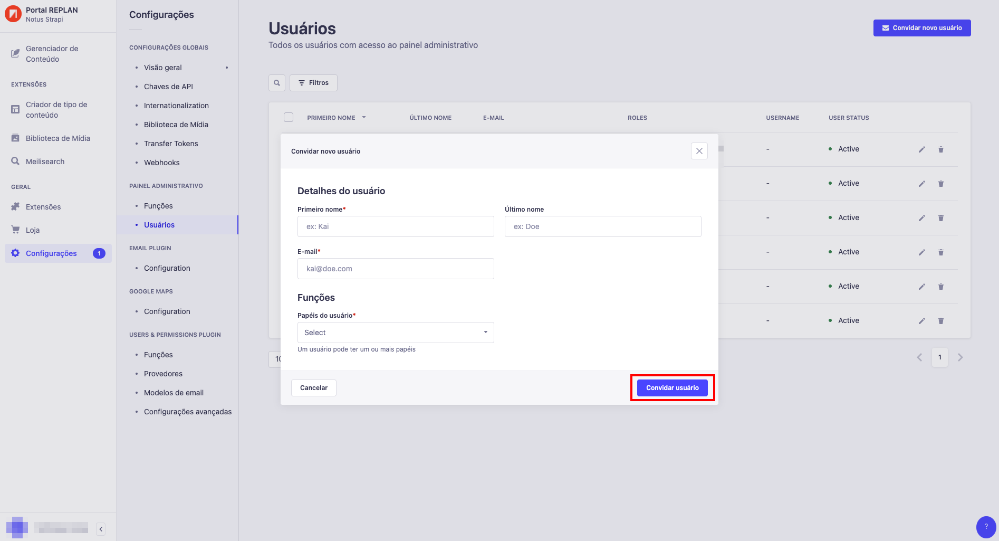
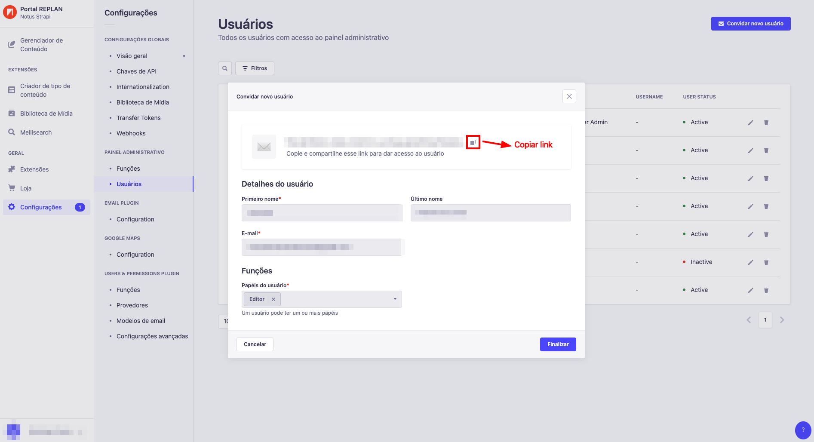
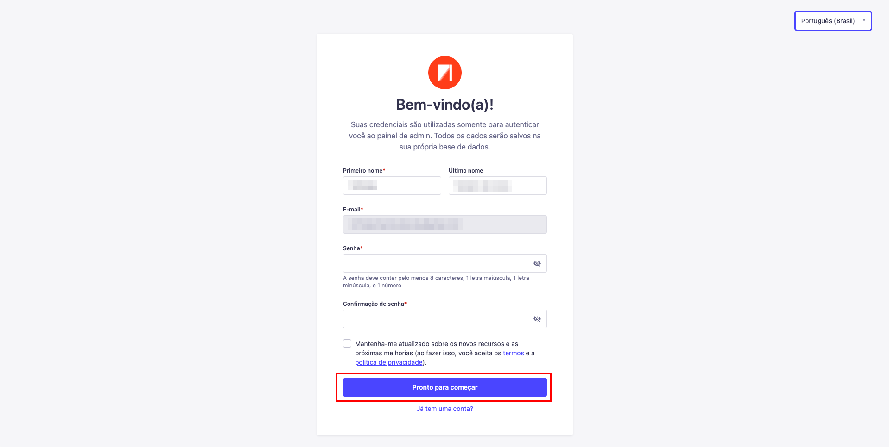

---

title: Convidando um usuário
description: Aprendendo a convidar um usuário
sidebar_position: 1

---

## Enviando o convite

Para convidar um usuário para o Strapi é bem simples e intuitivo, primeiramente vá para `"Configurações"` e na barra lateral que irá abrir, entre em `"Usuários"` e clique em `"Convidar novo usuário"`

Após clicar em `"Convidar novo usuário"`, um modal irá abrir pedindo informações do usuário a ser adicionado, após preencher as informações, clique em `"Convidar usuário"` e um link de convite será criado, basta copiá-lo e enviar para a pessoa que deseja cadastrar.

## Finalizando o cadastro

Quando entrar no link, você será apresentado com um formulário de cadastro, com o primeiro nome preenchido e o e-mail. Quando tiver preenchido todos os campos necessários, basta clicar em `"Pronto para começar"` que o cadastro estará completo.

