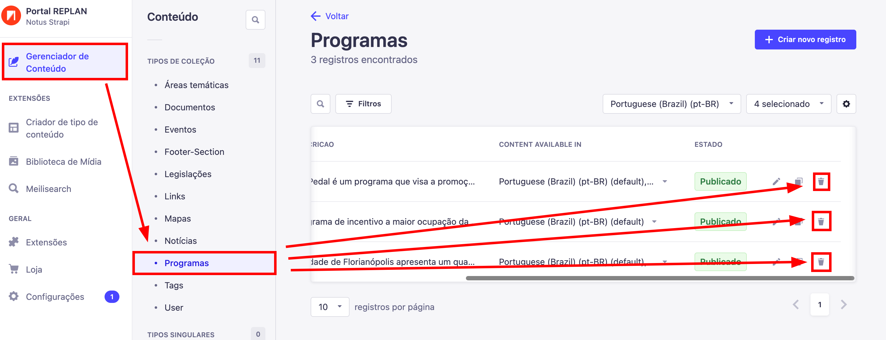
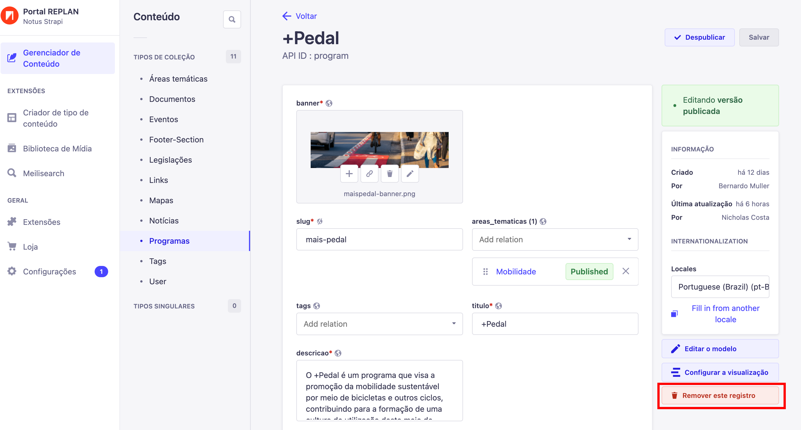

---

title: Apagando um Conteúdo
description: Apagando um conteúdo
sidebar_position: 4

---

## Apagando um Conteúdo

Existem dois caminhos que você pode escolher para apagar um registro

### Maneira rápida

Depois de entrar em `"Gerenciador de Conteúdo"` selecione `"Programas"` e clique no ícone de Lixeira em algum dos itens listados. Após clicar no ícone, você será apresentado com uma tela de confirmação e basta clicar em `"Confirmar"`

_PS:_ Caso não esteja vendo o ícone de lixeira, pode ser que o ícone esteja escondido, então basta entrar na tabela e usar o seu scroll para o lado direito.

_PS:_ Caso ainda sim não consiga, use o [método longo](#maneira-longa)

### Maneira longa

Depois de entrar em `"Gerenciador de Conteúdo"` selecione `"Programas"` e clique em algum dos programas listados, para abrir a sua tela de edição.

Após abrir a janela de edição, clique em `"Remover este registro"`, você será apresentado com uma tela de confirmação e basta clicar em  `"Confirmar"`

