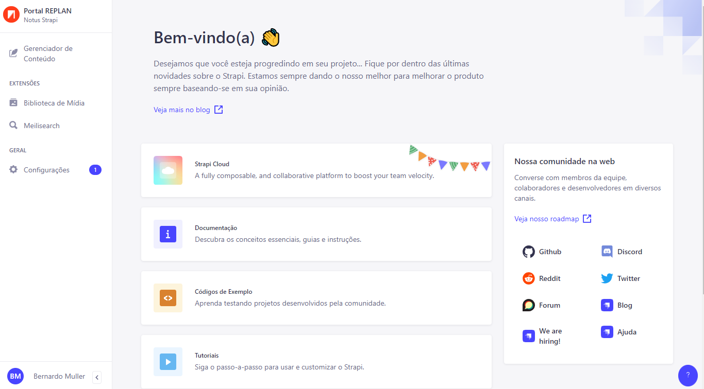
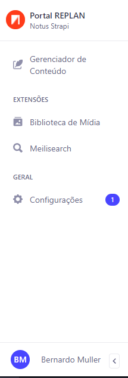
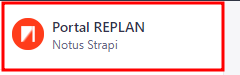
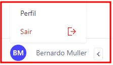
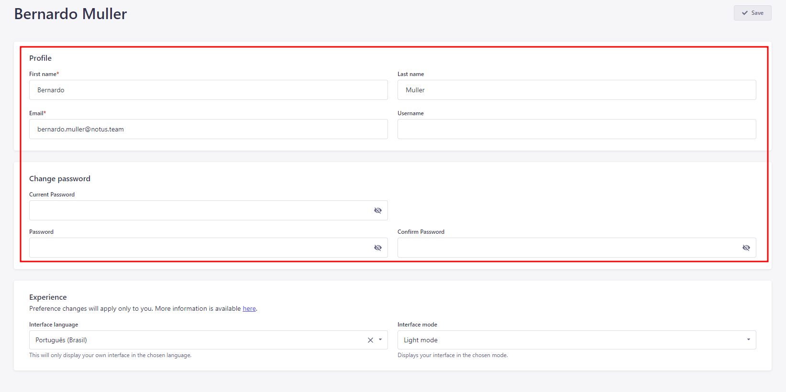
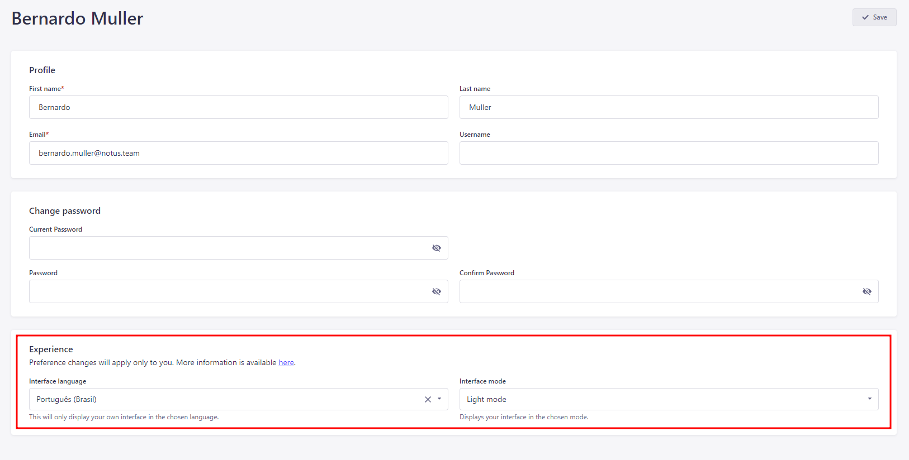
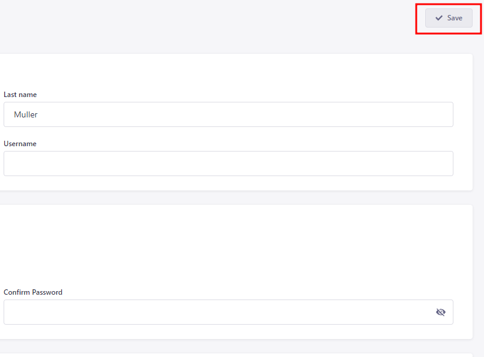

Aqui traremos um passo-a-passo mais detalhado sobre como logar, adicionar e
editar conteúdo utilizando o Strapi.

## Primeiro, Entrando em sua Conta

Ao acessar a URL do Strapi fornecida, você vai se deparar com esta tela. Tudo
que têm a fazer é logar usando seu usuário e senha de acesso.

Caso tenha algum problema relacionado ao login, entre em contato!

## Visão Geral

Após o login, você será redirecionado à esta `Tela Inicial`, contendo um
`Painel Principal` a esquerda e informações do provenientes do próprio Strapi, a
leitura deste material não é necessária. Na direita há um painel de comunidades
também do Strapi, que podemos ignorar.

## Painel Principal:

Localizado na esquerda da tela, o `Painel  Principal` nos permite realizar
algumas funções ou mudar configurações caso necessário.

### Voltar para a Tela Inicial

Caso haja necessidade de voltar a `Tela Inicial`, basta clicar na logo ou nome
destacado abaixo:

### Perfil Usuário

As informações de seu `Perfil` podem ser alteradas clicando em seu nome ou sigla
no canto inferior esquerdo e depois em `Perfil`. Também é aqui que podemos
`Sair` da conta do usuário caso necessário.

### Editar Perfil

Aqui é possível alterar seus dados como nome de usuário e senha:

Mais abaixo, podemos alterar a `Língua de Exibição` e `Tema da Interface` (modo
claro ou escuro):

As mudanças de língua e tema serão aplicados apenas à você, então escolha o que
preferir ou for mais confortável.

Após feitas suas mudanças não se esqueça de `Salvar`!

