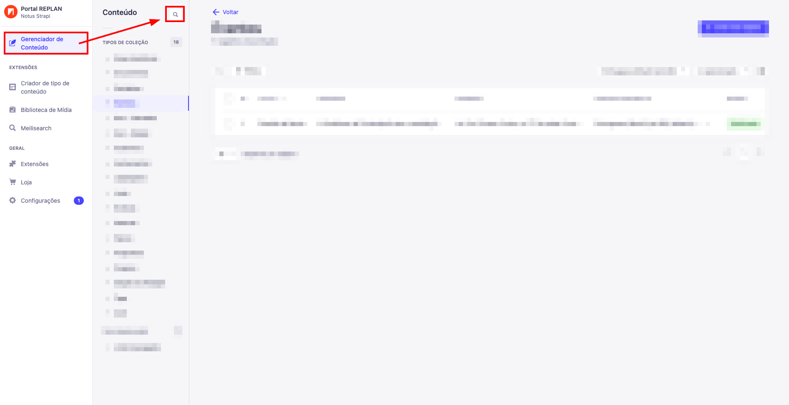
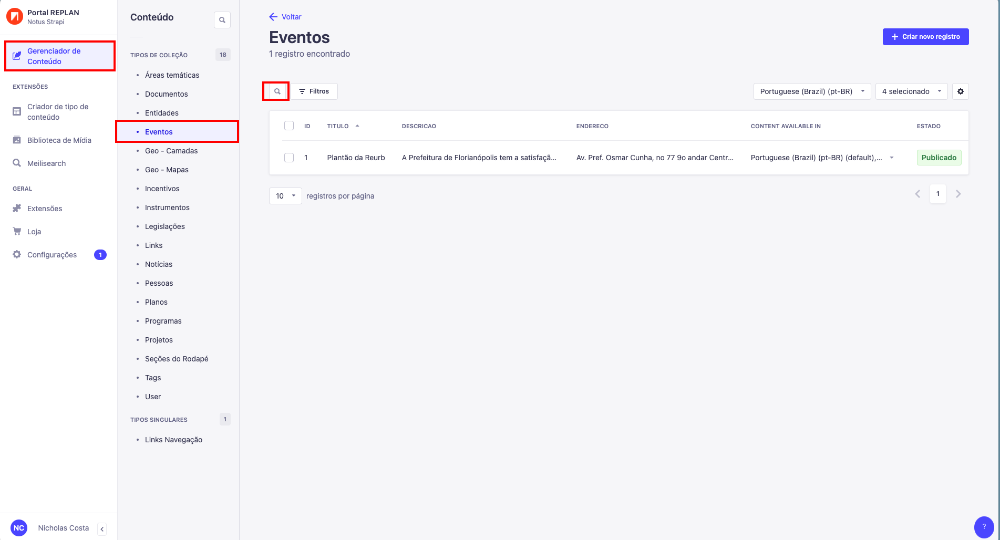

A pesquisa dentro do nosso CMS(Sistema de gerenciamento de conteúdo) é dividida
em duas partes, pesquisa por coleção e pesquisa dentro da coleção.

### Procura por coleção

Para pesquisar dentro da coleção, você pode clicar em "Gerenciador de Conteúdo"
e ao lado de "Conteúdo", clicar no ícone de Lupa. Dentro dele, você poderá
procurar por nome de coleções, caso precise de uma procura mais específica, você
terá que entrar na coleção desejada e procurar.

### Procura por conteúdo

Como dito acima, para buscar por conteúdo específico, você precisará entrar na
coleção que deseja e clicar no ícone de Lupa ao lado esquerdo de "Filtros", a
pesquisa pode ser feita por qualquer conteúdo que esteja dentro da coleção. Na
foto a seguir estarei mostrando a coleção de exemplos, mas isso servirá para
todas as coleções disponíveis.

