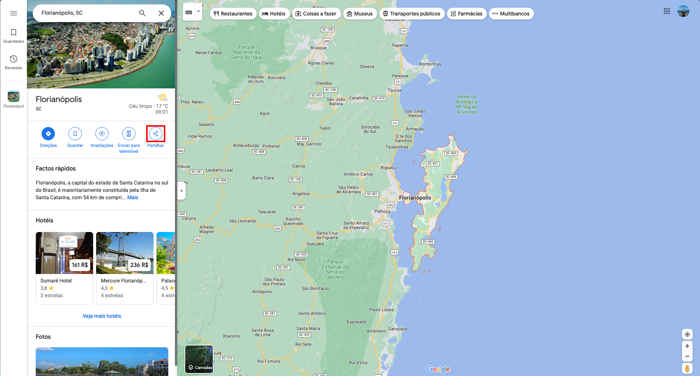
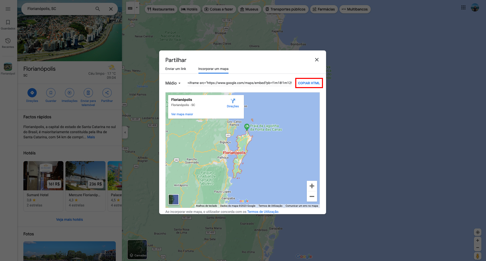

---

title: Adicionar Mapa do Google
description: Adicionando um embed do Google Maps
sidebar_position: 4

---

#### Como pegar o mapa do Google Maps

Para pegar o mapa é bem simples, primeiro, vá para o [google maps](https://maps.google.com) e pesquise o local que voce deseja mostrar no mapa. Após estar no local, no menu lateral, clique em partilhar.

Após clicar em partilhar, um modal irá aparecer na tela, dentro dele, clique em `"Incorporar um mapa"`

Após clicar em `"Incorporar um mapa"`, uma nova aba irá aparecer com um botão escrito `"Copiar HTML"`, que é exatamente o conteúdo que você precisa colocar no campo _`local_mapa`_, depois cole no campo sem nenhuma alteração.

