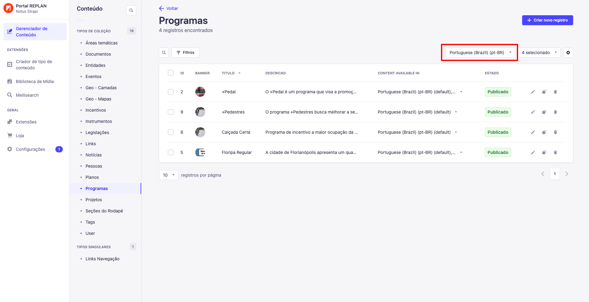
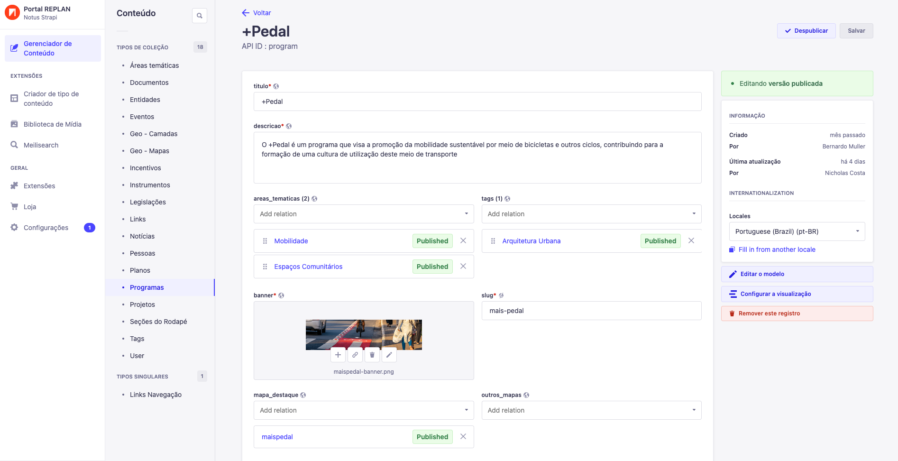
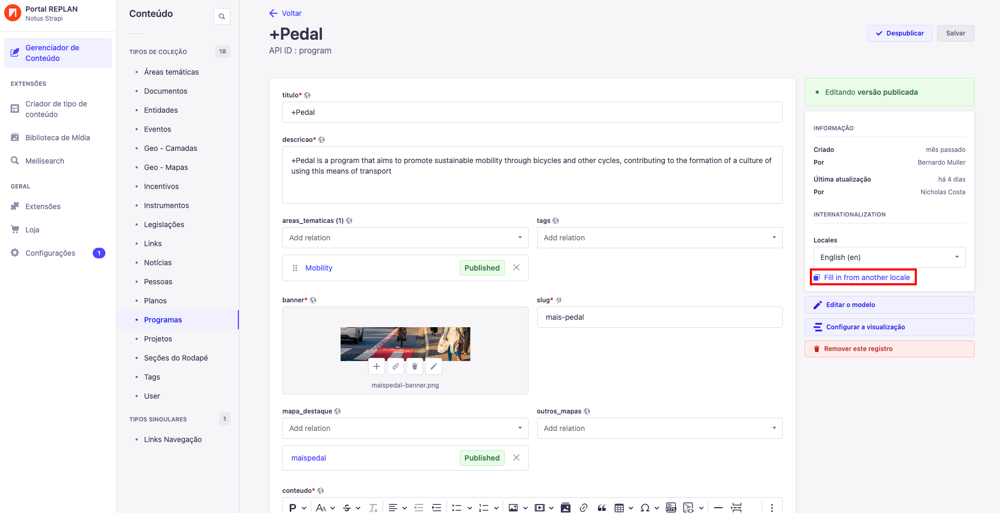
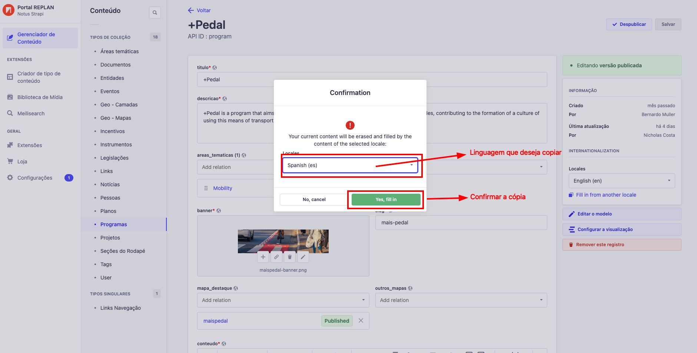

:::tip Nota

As linguagens disponíveis no momento são:

1. Português(pt-BR)
2. Inglês(en)
3. Espanhol(en)

:::

:::danger Importante

É de extrema importância sempre disponibilizar os conteúdos nas três linguagens
disponíveis(Português, Inglês e Espanhol), não apenas pela distribuição dos
conteúdos, mas também para a sua disponibilidade.

Caso os conteúdos não estejam disponíveis na linguagem selecionada, a página não
existirá para o usuário dentro da aplicação caso não tenha o conteúdo gerado na
linguagem selecionada. Se não tiver como distribuir em todas linguagens no
momento de sua criação, pelo menos crie o conteúdo com os mesmos textos de outra
linguagem, assim se terá a garantia que todos conteúdos poderão ser acessados
independente da linguagem selecionada pelo usuário.

:::

Internacionalização é super importante para tornar os conteúdo acessíveis à
todos foi escolhido como requisito mínimo para todos os conteúdos que
necessitarem de internacionalização.

## Como saber se o conteúdo precisa de internacionalização.

Na listagem do conteúdo desejado, se tiver um dropdown com opções de linguagens
como esse abaixo, significa que o conteúdo possui necessidade de
internacionalização.

## Como adicionar conteúdo em outros idiomas

Para adicionar o conteúdo em outra linguagem, basta entrar no conteúdo desejado
e no menu escrito "locales" na barra lateral direita, estará disponível a lista
de lingaugens na qual o conteúdo deve ser escrito. Basta selecionar o que quiser
e completar com os dados necessários. Alguns campos se mantém independente da
linguagem, se isso acontecer, não se preocupe, você não está fazendo nada de
errado.

Caso deseje copiar o conteúdo de outra linguagem para a linguagem atual, basta
entrar na linguagem desejada e clicar em "Fill in from another locale" e
selecionar a linguagem no qual deseja copiar para o conteúdo atual e um modal se
abrirá.

Basta selecionar a linguagem da qual deseja copiar e confirmar a cópia clicando
em "Yes, fill in"

