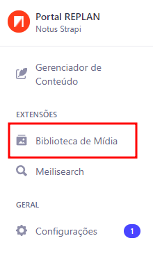
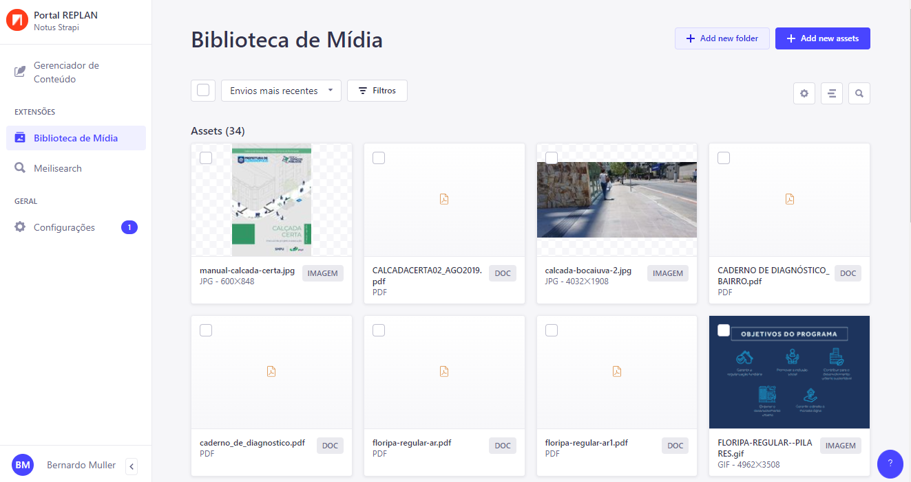

## O que é

A Biblioteca de Mídia no Strapi é uma funcionalidade que permite aos usuários gerenciar e armazenar arquivos de mídia, como imagens, vídeos, documentos e outros tipos de arquivos, diretamente no painel administrativo do Strapi. Essa biblioteca facilita o gerenciamento de ativos de mídia utilizados em seus conteúdos, como imagens em artigos, banners, ou outros recursos que precisam ser exibidos em seu aplicativo ou site.

## Onde fica

No `Painel Principal`, localizado a esquerda.

## Visão Geral

Aqui temos uma visão geral da sessão de gerenciamente de mídia. Entraremos em mais detalhes nas sessões específicas de como `Adicionar`, `Remover` ou `Encontrar` mídias dentro do Strapi.

