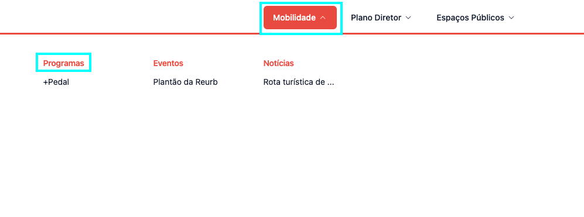

Como o processo é o mesmo para criar qualquer conteúdo, siga o tutorial de
[Criando um Conteúdo](/docs/guias/gestao-de-conteudo/criando.md).

## Campos

Para criar uma área temática é bem simples, existem campos obrigatórios(marcado
com "\*") e opcionais, entre eles estão:

1. [**titulo**](#titulo)\*
2. [**descricao**](#descricao)\*
3. [**cor**](#cor)\*
4. [**documentos**](#documentos)
5. [**eventos**](#eventos)
6. [**noticias**](#noticias)
7. [**legislacoes**](#legislacoes)
8. [**programas**](#programas)\*

### titulo\*

Título para a área temática.

### descricao\*

Descrição para a área temática.

### cor

Cor base da área temática, será usada em todas páginas em que a cor da área
temática é usada para identificação, por exemplo:

### documentos

Documentos no qual a área temática tem relação, será útil para possíveis filtros
futuros e possibilitar o usuário baixá-los.

### eventos

Eventos no qual a área temática tem relação, será útil para possíveis filtros
futuros.

### noticias

Notícias no qual a área temática tem relação, será útil para possíveis filtros
futuros.

### legislacoes

Legislações no qual a área temática tem relação, será útil para possíveis
filtros futuros.

## programas

Programas no qual a área temática tem relação, será útil para possíveis filtros
futuros.
