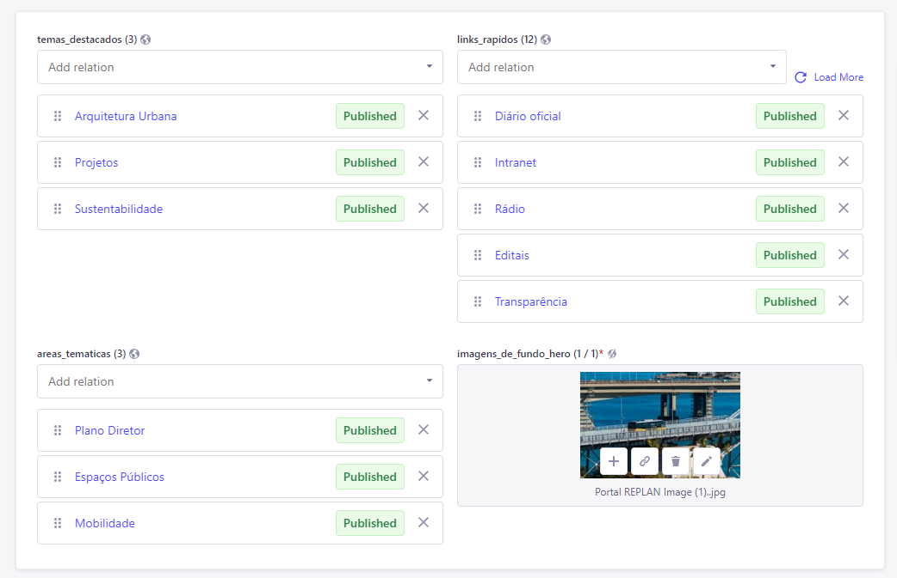
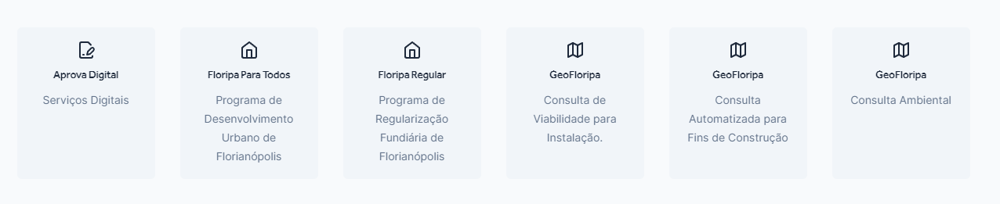

---

title: Homepage
description: Especificações da Homepage
sidebar_position: 1

---

## Introdução

A __Homepage__ (Página Inicial) é uma interface para a modificação da página inicial do portal, ela é um tipo único, ou seja, não pertence a coleções. Essa interface possui relações que ao serem selecionadas irão mostrar o conteúdo escolhido na página, e também há um campo obrigatório para imagens de fundo.

Como o processo é o mesmo para criar qualquer conteúdo, siga o tutorial de [Criando um Conteúdo](/docs/guias/gestao-de-conteudo/criando.md).

## Campos

:::tip Nota

A ordem dos campos pode não ser exatamente a encontrada aqui.

:::

Os campos com um asterisco (*) vermelho são obrigatórios e devem ser preenchidos, e os demais são opcionais. São eles:

1. [__temas_destacados__](#temas_destacados)*
2. [__links_rapidos__](#links_rapidos)
3. [__areas_tematicas__](#areas_tematicas)
4. [__imagens_de_fundo_hero__](#imagens_de_fundo_hero)*

### temas_destacados

Uma relação de Tags (temas) a seres destacados em sessões específicas na página inicial.

### links_rapidos

Uma relação de Links com o intuito de exibir links rápidos em uma sessão da página inicial.

### areas_tematicas

Uma relação com áreas temáticas que serão exibidas em uma sessão da página inicial.

### imagens_de_fundo_hero*

É um campo obrigatório para adicionar uma ou mais imagens para serem utilizadas como fundo da Hero na página inicial.
