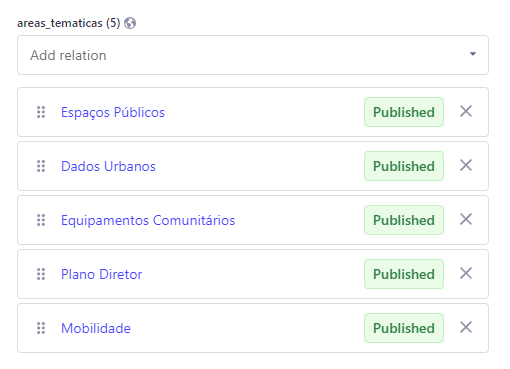

---

title: Megamenu
description: Especificações do Megamenu
sidebar_position: 2

---

## Introdução

O __Megamenu__ é uma interface para a modificação do Megamenu do portal.

## Campos

:::tip Nota

A ordem dos campos pode não ser exatamente a encontrada aqui.

:::

1. [__areas_tematicas__](#areas_tematicas)*

### areas_tematicas

Este é o único campo nesta interface, e é um campo de relacionamento com áreas temáticas que selecionaremos quais áreas desejamos incluir para exibir no menu.

