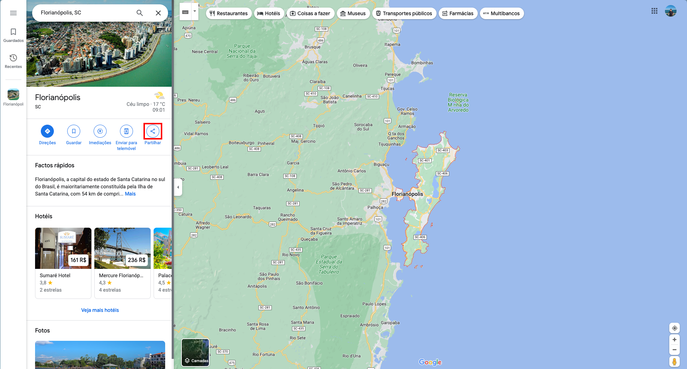
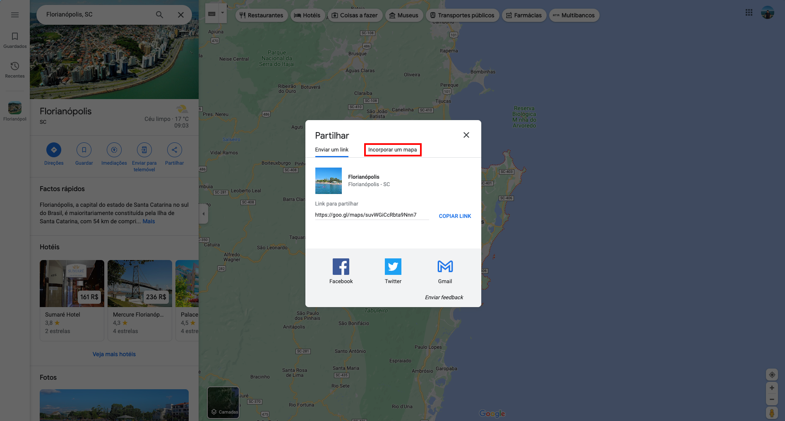

---

title: Entidade
description: Especificações de uma Entidade
sidebar_position: 8

---

As entidades participantes da Rede de Planejamento da Cidade de Florianópolis são organizações, instituições, órgãos governamentais, empresas, organizações não governamentais (ONGs) e outras entidades que estão envolvidas de alguma forma nos processos de planejamento, desenvolvimento urbano, sustentabilidade e ações relacionadas à cidade de Florianópolis.

Essas entidades participantes desempenham um papel importante na colaboração, coordenação e implementação de projetos e iniciativas que visam o crescimento ordenado, sustentável e equitativo da cidade. Elas podem contribuir com expertise, recursos, conhecimento técnico, financiamento e participação ativa nos debates e decisões que moldam o futuro da cidade.

As entidades participantes podem incluir:

- Órgãos Governamentais: Diferentes níveis de governo, como prefeitura, secretarias municipais, agências de planejamento e outros órgãos governamentais envolvidos em questões urbanas.
- Empresas e Investidores: Empresas imobiliárias, construtoras, incorporadoras e outros investidores que contribuem para o desenvolvimento de projetos urbanos e imobiliários.
- Universidades e Instituições Acadêmicas: Instituições de ensino superior e pesquisa que trazem conhecimento técnico e científico para o planejamento urbano.
- Organizações Não Governamentais (ONGs): Entidades da sociedade civil que têm interesses na qualidade de vida urbana, preservação ambiental, inclusão social e outros aspectos.
- Associações Profissionais: Associações de arquitetos, urbanistas, engenheiros, ambientalistas e outros profissionais relacionados ao planejamento e desenvolvimento urbano.
- Comunidades Locais: Grupos de moradores, bairros e comunidades que desejam participar ativamente nos processos de planejamento.
- Entidades Culturais e de Patrimônio: Organizações que trabalham na preservação do patrimônio histórico e cultural da cidade.
- Organizações de Meio Ambiente: Organizações focadas na conservação do meio ambiente, sustentabilidade e desenvolvimento verde.

A colaboração entre essas entidades é fundamental para garantir que o planejamento urbano seja abrangente, inclusivo e bem informado. A identificação das entidades participantes ajuda a garantir que os planos, projetos e decisões tomadas para o desenvolvimento da cidade reflitam uma ampla gama de perspectivas e interesses, contribuindo para uma cidade mais resiliente, equilibrada e sustentável.

Como o processo é o mesmo para criar qualquer conteúdo, siga o tutorial de [Criando um Conteúdo](/docs/guias/gestao-de-conteudo/criando.md).

## Campos

Para criar uma entidade é bem simples, existem campos obrigatórios(marcado com "*") e opcionais, entre eles estão:

1. [__nome__](#nome)*
2. [__slug__](#slug)*
3. [__sigla__](#sigla)
4. [__logo__](#logo)
5. [__conteudo__](#conteudo)*
6. [__local__](#local)
7. [__email__](#email)
8. [__pessoas__](#pessoas)
9. [__documentos_emitidos__](#documentos_emitidos)

### nome

Nome para a entidade.

### slug*

Caso você não esteja familiarizado com _slugs_, essa palavra pode ser um pouco estranha, mas o slug serve como um identificador para a página que seja conciso e mais legível por uma pessoa.

Para gerar um slug a partir de um texto, você pode usar [esse site](https://slugify.online/) no qual converte textos para formatação de slug.

### sigla

Sigla identificadora para a entidade.

### logo

Imagem para aparecer como logo para a entidade.

### conteudo

Texto para o conteúdo da entidade.

### local

iframe do google maps

#### Como pegar o iframe

Para pegar o iframe é bem simples, primeiro, vá para o [google maps](https://maps.google.com) e pesquise o local que voce deseja mostrar no mapa. Após estar no local, no menu lateral, clique em partilhar.

Após clicar em partilhar, um modal irá aparecer na tela, dentro dele, clique em `"Incorporar um mapa"`

Após clicar em `"Incorporar um mapa"`, uma nova aba irá aparecer com um botão escrito `"Copiar HTML"`, que é exatamente o conteúdo que você precisa colocar no campo _`local`_, depois cole no campo sem nenhuma alteração.

### email

Email para contato com a entidade.

### pessoas

Pessoas relacionadas com essa entidade.

### documentos_emitidos

Documentos emitidos pela entidade.
