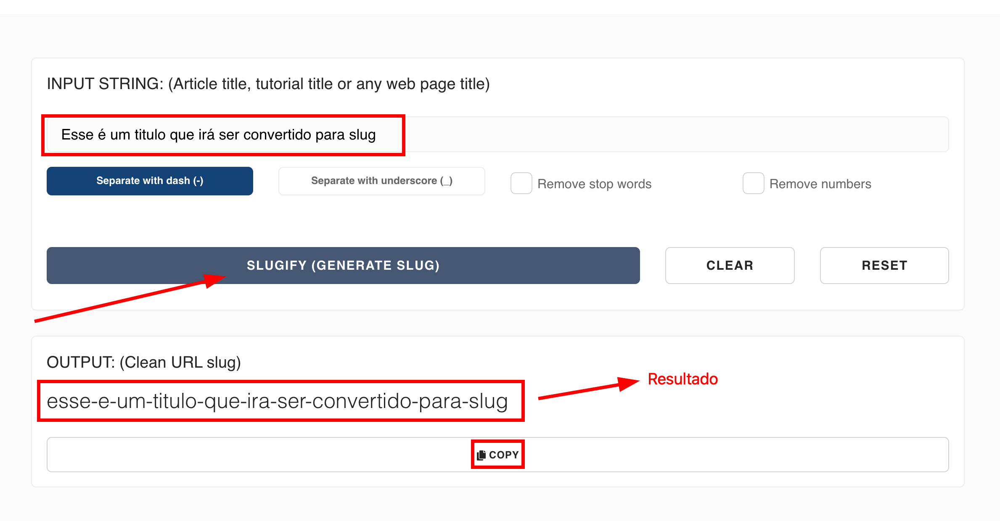

---

title: Paisagem e Patrimônio
description: Especificações de Paisagem e Patrimônio
sidebar_position: 9

---

## Introdução

Intro Paisagem e Patrimonio

Como o processo é o mesmo para criar qualquer conteúdo, siga o tutorial de [Criando um Conteúdo](/docs/guias/gestao-de-conteudo/criando.md).

## Campos

:::tip Nota

A ordem dos campos pode não ser exatamente a encontrada aqui.

:::

Para criar um instrumento é bem simples, existem campos obrigatórios(marcado com "*") e opcionais, entre eles estão:

1. [__titulo__](#titulo)*
2. [__descricao__](#descricao)*
3. [__areas_tematicas__](#areas_tematicas)
4. [__tags__](#tags)
5. [__banner__](#banner)*
6. [__slug__](#slug)*
7. [__mapa_destaque__](#mapa_destaque)
8. [__geo_mapas__](#geo_mapas)
9. [__conteudo__](#conteudo)*
10. [__documentos__](#documentos)
11. [__legislacoes__](#legislacoes)
12. [__eventos__](#eventos)
13. [__noticias__](#noticias)
14. [__projetos__](#projetos)
15. [__gestao__](#gestao)
16. [__planos__](#planos)
17. [__redes__](#redes)
18. [__instrumentos__](#instrumentos)
19. [__incentivos__](#incentivos)
20. [__visivel_megamenu__](#visivel_megamenu)*

### banner*

Essa imagem será utilizada na listagem de instrumentos para uma fácil visualização para o usuário que estiver pesquisando por algum instrumento.

### slug*

Caso você não esteja familiarizado com _slugs_, essa palavra pode ser um pouco estranha, mas o slug serve como um identificador para a página que seja conciso e mais legível por uma pessoa.

Para gerar um slug a partir de um texto, você pode usar [esse site](https://slugify.online/) no qual converte textos para formatação de slug.

### titulo*

Título para o instrumento, aparecerá no começo da página sobre o fundo da cor da área temática escolhida para o instrumento.

### descricao*

Descrição para o instrumento, aparecerá no começo da página sobre o fundo da cor da área temática escolhida para o instrumento.

### conteudo*

Conteúdo a ser renderizado na página.

### mapa_destaque

Mapa que aparecerá em destaque na página do instrumento.

### geo_mapas

Outros mapas que irão aparecer na página.

### tags

As tags são textos pequenos que relacionam com alguma característica do instrumento, útil para futuras filtragens de pesquisas dos usuários.

### areas_tematicas

A partir de qual área temática o instrumento se relacionar, ele entrará na divisão correspondente dentro do menu de navegação.

### eventos

Eventos no qual o instrumento foi citado ou está citando, será útil para possíveis filtros futuros e recomendar eventos para os usuários.

### documentos

Documentos que foram mencionados no instrumento, será útil para possíveis filtros futuros e possibilitar o usuário baixá-los.

### legislacoes

Legislações mencionadas no instrumento será útil para possíveis filtros futuros .

### noticias

Notícias no qual o instrumento foi citado ou está citando, será útil para possíveis filtros futuros.

### projetos

Projetos que o instrumento citou ou está citando, será útil para possíveis filtros futuros.

### gestao

Gestão responsável.

### planos

Planos relacionados ao conteúdo da página.

### redes

Redes relacionados ao conteúdo da página.

### instrumentos

Instrumentos relacionados ao conteúdo da página.

### incentivos

Incentivos relacionados ao conteúdo da página.

### visivel_megamenu*

Um campo para escolher se este conteúdo aparece ou não no [Megamenu](../interfaces/megamenu.md), o padrão é falso.
