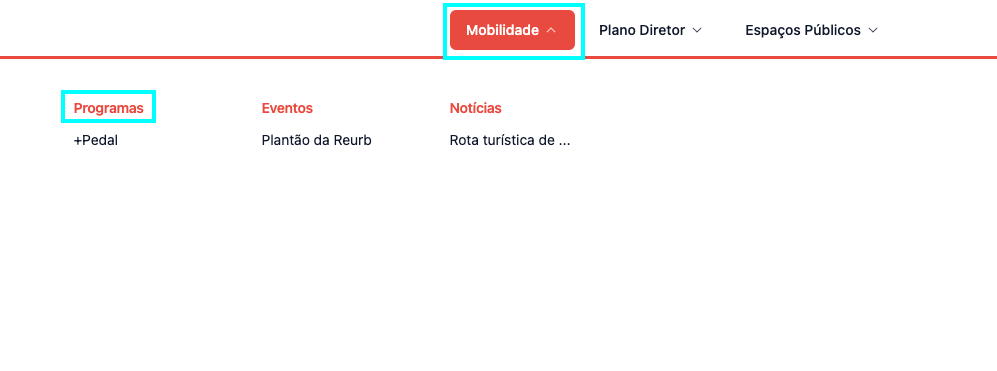

---

title: Criando uma Área Temática
description: Aprendendo a criar uma área temática dentro do strapi
sidebar_position: 1

---
Como o processo é o mesmo para criar qualquer conteúdo, siga o tutorial de [Criando um Conteúdo](/docs/strapi/iniciando-gerenciamento#criando-conteúdo).

## Campos

Para criar uma área temática é bem simples, existem campos obrigatórios(marcado com "*") e opcionais, entre eles estão:

1. [__titulo__](#titulo)*
2. [__descricao__](#descricao)*
3. [__programas__](#conteudo)*
4. [__documentos__](#documentos)
9. [__eventos__ ](#eventos)
10. [__legislacoes__](#legislacoes)
11. [__noticias__](#noticias)
12. [__cor__](#cor)*

### titulo*

Título para a área temática.

### descricao*

Descrição para a área temática.

### documentos

Documentos no qual a área temática tem relação, será útil para possíveis filtros futuros e possibilitar o usuário baixá-los.

### eventos

Eventos no qual a área temática tem relação, será útil para possíveis filtros futuros e possibilitar o usuário baixá-los.

### legislacoes

Legislações no qual a área temática tem relação, será útil para possíveis filtros futuros e possibilitar o usuário baixá-los.

### noticias

Notícias no qual a área temática tem relação, será útil para possíveis filtros futuros e possibilitar o usuário baixá-los.

### cor

Cor base da área temática, será usada em todas páginas em que a cor da área temática é usada para identificar, por exemplo:

