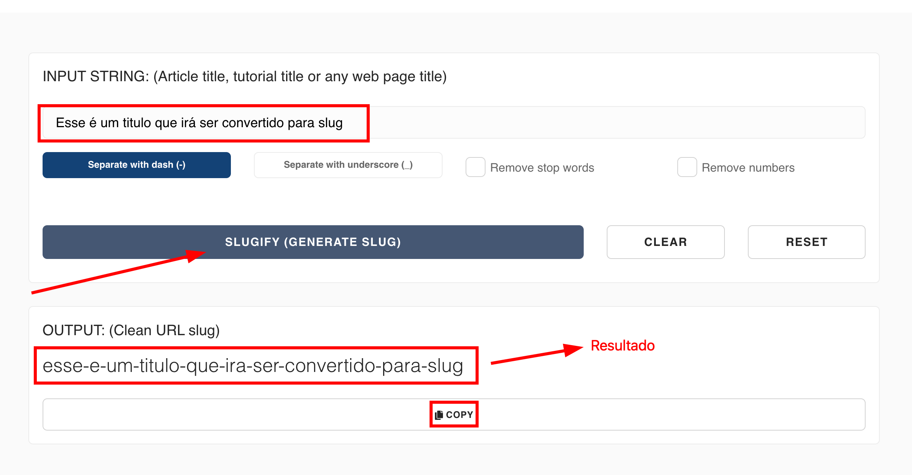

---

title: Criando um Documento
description: Aprendendo a criar um documento dentro do strapi
sidebar_position: 1

---

Como o processo é o mesmo para criar qualquer conteúdo, siga o tutorial de [Criando um Conteúdo](/docs/strapi/iniciando-gerenciamento#criando-conteúdo).

## Campos

Para criar um documento é bem simples, existem campos obrigatórios(marcado com "*") e opcionais, entre eles estão:

1. [__banner__](#banner)*
2. [__titulo__](#titulo)*
3. [__descricao__](#descricao)*
4. [__arquivos__](#arquivos)*
7. [__tags__](#tags)
8. [__areas_tematicas__](#areas_tematicas) 
9.  [__eventos__ ](#eventos)
11. [__legislacoes__](#legislacoes)
12. [__programas__](#programas)

### banner*

Essa imagem será utilizada em todas listagens de documentos para uma fácil visualização para o usuário que estiver pesquisando por algum documento.

### slug*

Caso você não esteja familiarizado com _slugs_, essa palavra pode ser um pouco estranha, mas o slug serve como um identificador para a página que seja conciso e mais legível por uma pessoa.

Para gerar um slug a partir de um texto, você pode usar [esse site](https://slugify.online/) no qual converte textos para formatação de slug.

### titulo*

Título para o documento, será útil para futuras filtragens de pesquisas dos usuários.

### descricao*

Descrição para o documento, será útil para futuras filtragens de pesquisas dos usuários .

### arquivos*

Arquivos relacionados a esse documento, serão disponibilizados para baixar.

### tags

As tags são textos pequenos que relacionam com alguma característica do documento, útil para futuras filtragens de pesquisas dos usuários.

### areas_tematicas

A partir de qual área temática o documento se relacionar, será útil para futuras filtragens de pesquisas dos usuários. Caso ainda não tenha criado uma Área Temática, crie [por aqui](/docs/strapi/area-tematica/criar)

### programas

Programas no qual esse documento foi citado, será útil para futuras filtragens de pesquisas dos usuários.