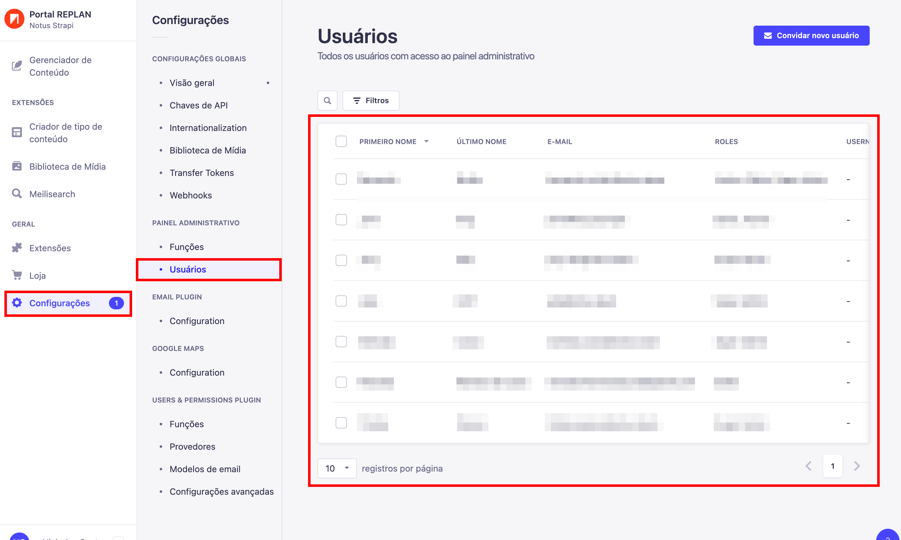
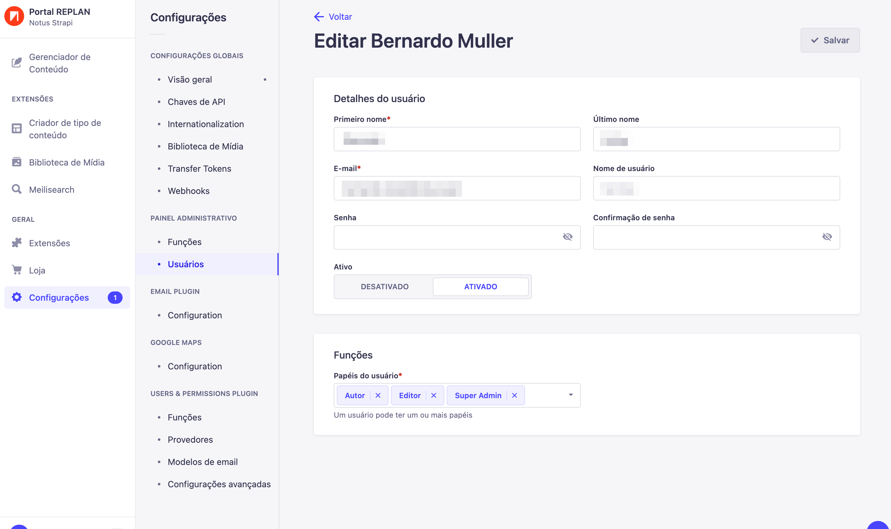

---

title: Editando um usuário
description: Aprendendo a editar dados de um usuário
sidebar_position: 2

---

Para editar dados de um usuário, primeiramente clique no botão `"Configurações"` no menu lateral esquerdo, depois clique em `"Usuários"` e clique em algum dos usuários listados.

Na página de edição do usuário, você pode alterar todas essas informações listadas, inclusive sua senha, caso desejar.

A parte mais importante é a de `"Funções"`, você pode adicionar ou remover funções do usuário, como desejar, todas permissões estarão atreladas a função designada para o usuário, então preste atenção na hora de designar suas funções.
