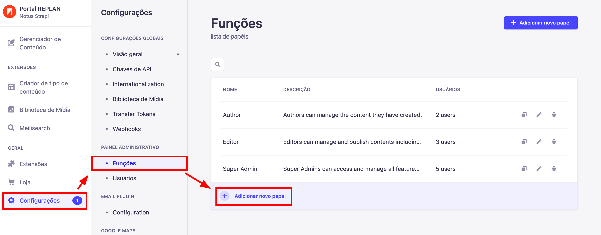

---

title: Funções
description: Aprendendo a criar e editar Funções
sidebar_position: 2

---

## Nota Importante

É importante sempre prestar atenção a quem está se dando as permissões e quais permissões estão sendo designadas aos usuários. Nunca dê permissões a mais para quem não precisa, apenas permita o necessário para o usuário exercer a sua função e nada mais.

## Criando uma função

Para começar, entre em `"Configurações` no menu lateral esquerdo, depois `"Funções"` e clique em `"Adicionar novo papel"`.

Após ter clicado em `"Adicionar novo papel"`, uma nova página abrirá mostrando as especificações da nova função.

Dê um nome e uma descrição para a nova função para ser mais fácil de identificar futuramente.

## Aprendendo sobre as permissões

Você pode limitar a permissão dos usuários, para coleções ou campos. Mudar permissões em coleções afeta a coleção inteira, mas caso deseje ser mais específico, você pode mudar a permissão de campos pra determinado usuário. Agora vamos entender um pouco mais sobre as divisões de permissões.

### Criar

A permissão de criar, permite um usuário com essa função criar um conteúdo dentro da coleção selecionada, sem essa permissão, o usuário não conseguirá fazer isso.

### Ler

A permissão de ler é a mais básica, caso o usuário não possua a permissão de leitura, não irá conseguir enxergar a coleção ou os campos selecionados.

### Editar

A permissão de editar irá liberar a edição dos conteúdo já anteriormente criados para um usuário, caso o conteúdo não exista e o usuário não possua permissão de criar, não haverá como criar um conteúdo novo.

### Remover

A permissão de remover irá liberar a opção de apagar conteúdos.

### Publicar

Todo conteúdo criado no Strapi tem que ser publicado para conseguir ser acessado por fora dele, para isso é necessário essa permissão. Essa permissão é muito importante porque você não vai querer que conteúdos não completos sejam abertos ao público, por isso apenas dê essa permissão pra quem realmente deve poder executar.
