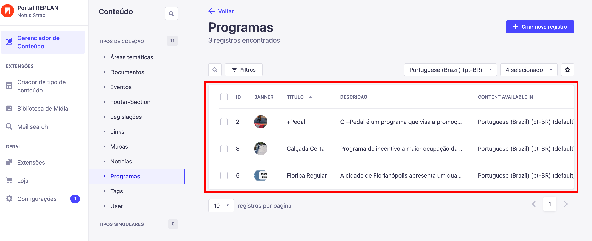
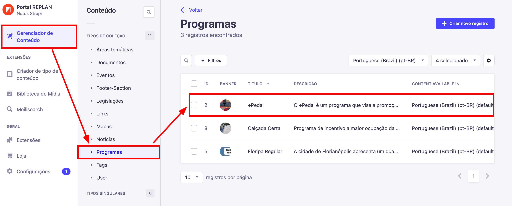

---

title: Básico para gerenciamento de conteúdo
description: Aprendendo o básico de gerenciamento de conteúdo.
sidebar_position: 4

---

# O básico para gerenciar conteúdo

> ### **Nota Importante**  
> A criação de conteúdo se mantém igual para todas as coleções dentro do Strapi, por isso, nos exemplos, estarei usando a coleção de programas, mas isso irá funcionar para qualquer coleção. Esse tutorial não é específico para a coleção de programas, caso queira entender algo específico da coleção de programas, basta ir para página específica da coleção.

Para começar a gerenciar os conteúdos, dentro do menu lateral você vai querer entrar em `"Gerenciador de Conteúdo"`, nele estará tudo relacionado ao gerenciamento de conteúdos, seja criar, editar ou apagar. Aprendendo o básico, tudo é muito intuitivo.

## Começando

Para criar o seu primeiro conteúdo, clique na aba `"Gerenciador de Conteúdo"`, nele abrirá uma nova página listando todos os conteúdos possíveis de serem editados. 

No momento em que estou escrevendo esta documentação temos apenas estas coleções, porém, pode ser que no momento em que você esteja utilizando já tenham sido criados mais coleções, mas o conceito continuará sendo o mesmo.

## Visualizando conteúdos

Para visualizar a lista de conteúdos relacionadas à uma coleção basta clicar na coleção desejada que uma página nova se abrirá listando todos conteúdos criados a partir da coleção selecionada.

Pode ser que você não tenha nenhum conteúdo criado até o momento, nesse caso, a lista de conteúdos estará vazia, para criar um conteúdo é também bem intuitivo.

## Criando conteúdo

### Preenchendo campos

Agora, dentro de uma coleção, basta clicar em `"Criar novo registro"`

Após clicar no botão, uma nova aba se abrirá mostrando os campos que devem ser preenchidos.

Existem campos obrigatórios(estão marcados com um "*" no nome) e campos opcionais. Os campos opcionais devem ser preenchidos a partir do objetivo final da criação do conteúdo e cabe a você decidir o que precisará ou não.

### Relacionamentos

Existem campos que se relacionam com outras coleções, na coleção de programas, por exemplo, mostrada na imagem acima, existe o campo `"areas_tematicas"` no qual você pode selecionar 1 ou mais áreas temáticas no qual o conteúdo pertence, porém, para selecionar uma área temática, é necessário ter criado uma pelo menos. 

Esse conceito continua para todas outras coleções na qual possui relacionamentos, você precisará criar um para poder selecionar.

### Internacionalização

Dependendo da coleção, você terá a opção de traduzir seu conteúdo, isso é muito importante para tornar o conteúdo acessível para todos. Você irá saber se um campo necessita ou não de tradução quando no menu lateral direito da criação ou edição do conteúdo tiver um botão com nome "Locales".

### Copiando internacionalização

**Mesmo que você não vá gerar uma tradução no momento para o conteúdo, crie o mesmo conteúdo na outra linguagem sem alterar os textos. É importante ter todos os conteúdos em todas linguagens disponíveis mesmo que ainda não haja a tradução no momento.**

Para fazer isso, basta entrar em um conteúdo após a criação do mesmo e no momento da edição, selecionar a linguagem desejada através do menu lateral na direita, por exemplo **"English (en)"**, clicar no botão escrito  `"Fill in from another locale"` e selecionar a linguagem no qual você deseja copiar para o conteúdo atual e confirmar clicando em `"Yes, fill in"`.

## Editando um Conteúdo

Para começar, entre em `"Gerenciador de Conteúdo"`, depois selecione `"Programas"` e clique em algum programa dentro da lista. Com isso, você será apresentado à tela de edição de um programa.

### Conclusão

Todo conteúdo já estará preenchido com os dados anteriores, caso queira um guia sobre os campos, siga o tutorial de [Criando um Conteúdo](#criando-conteúdo)

## Apagando um Conteúdo

Existem dois caminhos que você pode escolher para apagar um registro

### Maneira rápida

Depois de entrar em `"Gerenciador de Conteúdo"` selecione `"Programas"` e clique no ícone de Lixeira em algum dos itens listados. Após clicar no ícone, você será apresentado com uma tela de confirmação e basta clicar em `"Confirmar"`

_PS:_ Caso não esteja vendo o ícone de lixeira, pode ser que o ícone esteja escondido, então basta entrar na tabela e usar o seu scroll para o lado direito.

_PS:_ Caso ainda sim não consiga, use o [método longo](#maneira-longa)

### Maneira longa

Depois de entrar em `"Gerenciador de Conteúdo"` selecione `"Programas"` e clique em algum dos programas listados, para abrir a sua tela de edição.

Após abrir a janela de edição, clique em `"Remover este registro"`, você será apresentado com uma tela de confirmação e basta clicar em  `"Confirmar"`

