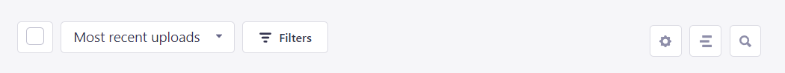
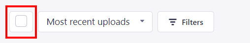
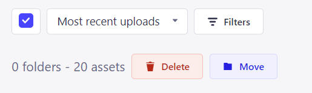
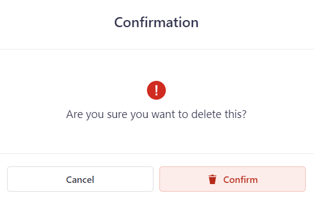
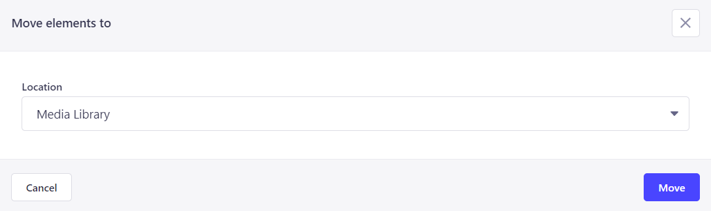

---

title: Painel de Opções
description: Explorando as outras opções do painel
sidebar_position: 3

---

**Vamos explicar um pouco do que cada item deste painel faz:**

### Selecionar Tudo

Clicando aqui podemos selecionar todos os arquivos existentes na tela atual. Clicando novamente podemos remover tudo.

Ao clicar, algumas opções aparecem em tela, sendo elas `Delete` (deletar) e `Move` (mover) os arquivos.

#### Deletar

Clicando em `Delete`, uma caixa se abrirá perguntando se você tem certeza de sua decisão.

#### Mover

Clicando em `Move`, um novo modal se abre, perguntando para onde mover os arquivos selecionados.

### Ordernar

### Filtrar

### Configurar visualização

### Modo Lista

### Procurar