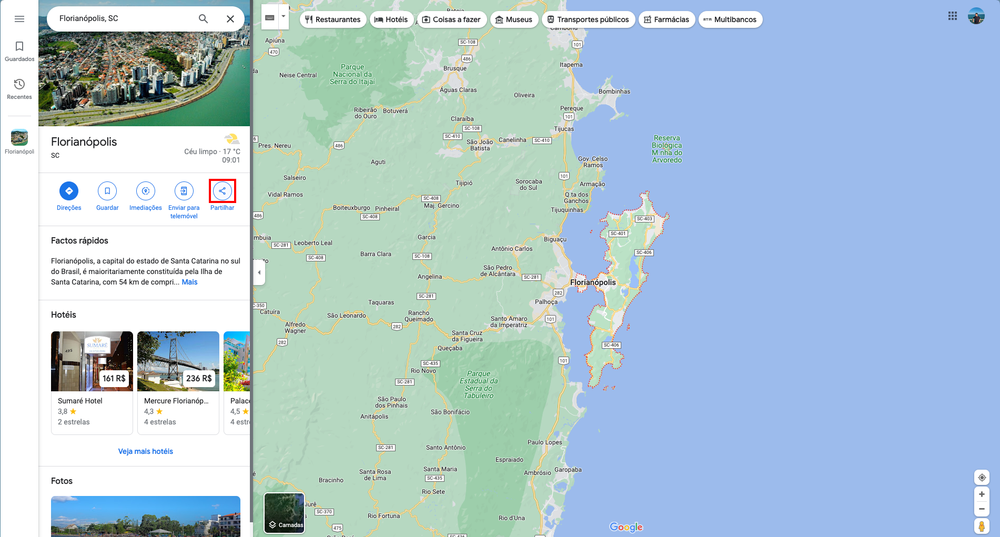
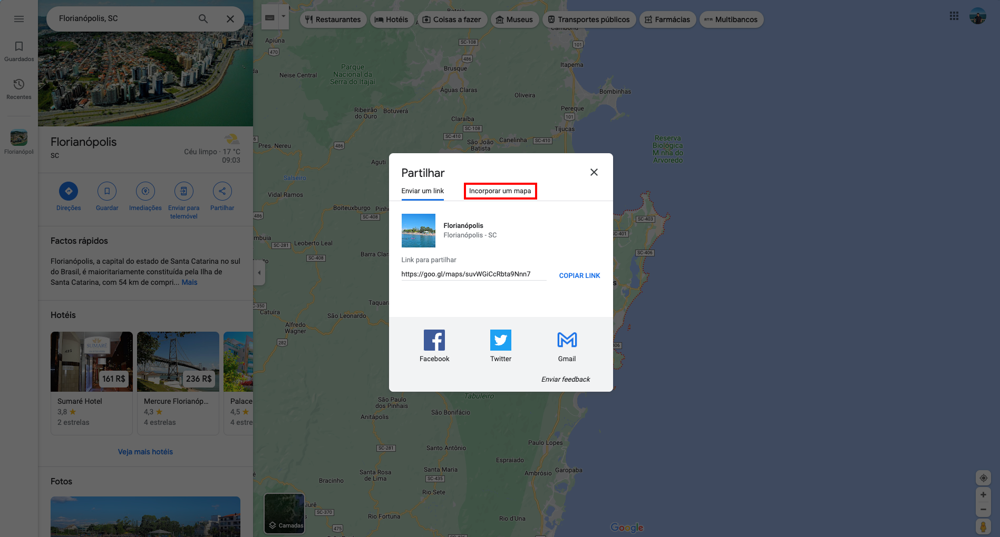
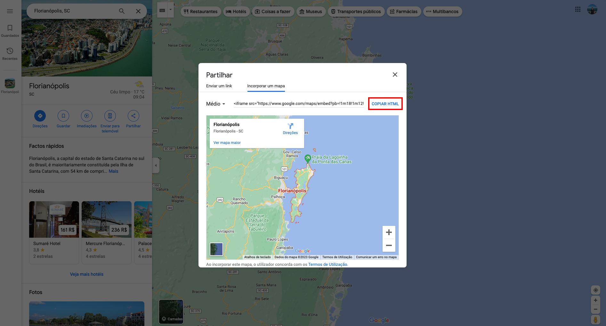

---

title: Criando uma Entidade
description: Aprendendo a criar uma entidade dentro do strapi
sidebar_position: 1

---

Como o processo é o mesmo para criar qualquer conteúdo, siga o tutorial de [Criando um Conteúdo](/docs/usuario/strapi/iniciando-gerenciamento#criando-conteúdo).

## Campos

Para criar uma entidade é bem simples, existem campos obrigatórios(marcado com "*") e opcionais, entre eles estão:

1. [__nome__](#nome)*
2. [__slug__](#slug)*
3. [__sigla__](#sigla)
4. [__logo__](#logo)
5. [__conteudo__](#conteudo)*
6. [__local__](#local)
7. [__email__](#email)
8. [__pessoas__](#pessoas)
9. [__documentos_emitidos__](#documentos_emitidos)

### nome

Nome para a entidade.

### slug*

Caso você não esteja familiarizado com _slugs_, essa palavra pode ser um pouco estranha, mas o slug serve como um identificador para a página que seja conciso e mais legível por uma pessoa.

Para gerar um slug a partir de um texto, você pode usar [esse site](https://slugify.online/) no qual converte textos para formatação de slug.

### sigla

Sigla identificadora para a entidade.

### logo

Imagem para aparecer como logo para a entidade.

### conteudo

Texto para o conteúdo da entidade.

### local

iframe do google maps

#### Como pegar o iframe

Para pegar o iframe é bem simples, primeiro, vá para o [google maps](https://maps.google.com) e pesquise o local que voce deseja mostrar no mapa. Após estar no local, no menu lateral, clique em partilhar.

Após clicar em partilhar, um modal irá aparecer na tela, dentro dele, clique em `"Incorporar um mapa"`

Após clicar em `"Incorporar um mapa"`, uma nova aba irá aparecer com um botão escrito `"Copiar HTML"`, que é exatamente o conteúdo que você precisa colocar no campo _`local`_, depois cole no campo sem nenhuma alteração.

### email

Email para contato com a entidade.

### pessoas

Pessoas relacionadas com essa entidade.

### documentos_emitidos

Documentos emitidos pela entidade.
