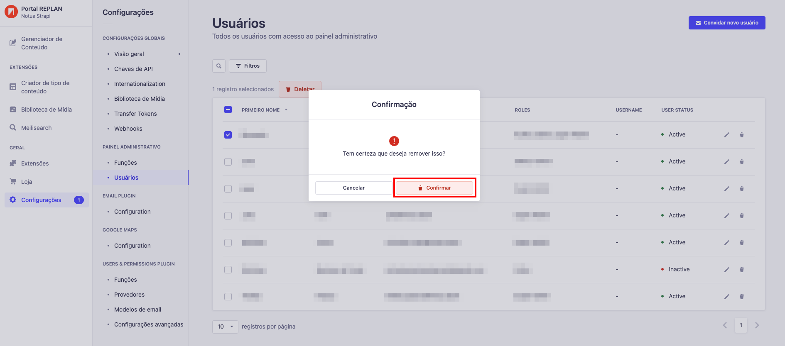

---

title: Apagando um usuário
description: Aprendendo a apagar um usuário
sidebar_position: 4

---

:::danger Nota Importante

Após apagar um usuário, a ação não pode ser revertida, um novo convite terá que ser criado para a pessoa receber o acesso novamente.

:::

Para apagar um usuário é bem simples, primeiro, no menu lateral esquerdo clique em `"Configurações"`, depois `"Usuários"` e você verá um ícone de lixeira logo ao lado de um usuário, basta clicar e um modal de confirmação irá aparecer e basta clicar em `"Confirmar"`.

