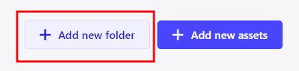
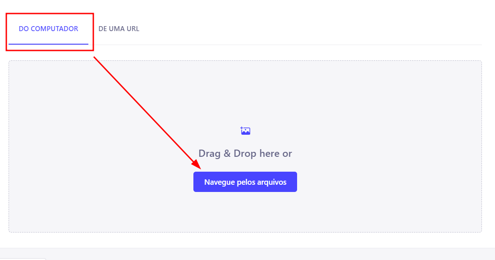
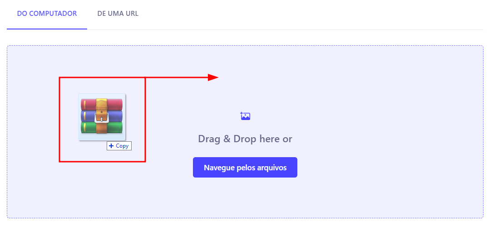
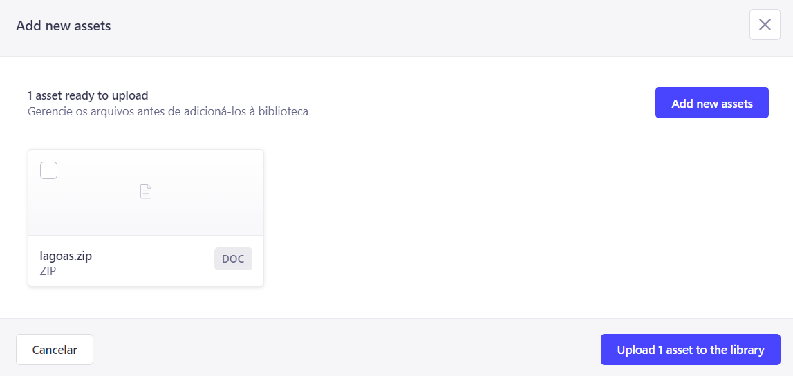
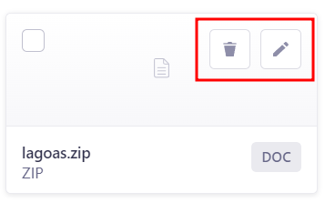
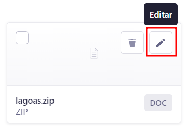
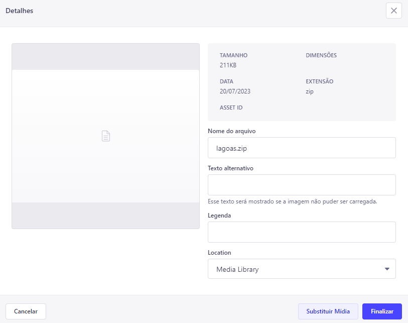
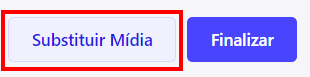
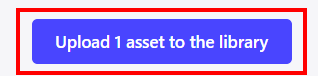

---

title: Adicionando Mídias
description: Como adicionar mídias usando a biblioteca de mídia no Strapi
sidebar_position: 3

---

No canto superior direito notamos dois botões, `Add new folder` (Adicionar pasta) e `Add new assets` (Adicionar novos arquivos).

## Adicionar Pasta

Adicionar pastas é um bom modo de manter os arquivos organizados, tendo em vista que todos os arquivos utilizados na aplicação estão aqui.

## Adicionar Arquivos

Clicando aqui irá abrir um modal onde podemos escolher entre pegar aquivos do computador ou de uma URL

Se for adicionar arquivos do computador, por padrão, esta é a opção selecionada, mas caso ela não esteja, clique em `DO COMPUTADOR` e em seguida em `Navegue pelos arquivos`. Uma janela padrão de seu sistema operacional abrirá, e por ela você adicionará os arquivos. 

Se preferir, você pode também arrastar os arquivos que deseja adicionar para a caixa entre linhas pontilhadas.

Após escolhidos os arquivos, uma nova tela irá aparecer, contendo os arquivos selecionados e alguns botões para Cancelar, Fechar, `Add new assets` (Adicionar novos arquivos) e `Upload X assets to the library` (Fazer o Upload de X arquivos à biblioteca)

Passando o mouse sobra um arquivo abre duas nova opções, é possível alterar detalhes do arquivo selecionado em `Editar` ou removê-lo na `Lixeira`.

### Editando Arquivos

Clicando em Editar, uma nova tela aparecerá, e nela é possível alterar o nome do arquivo, texto alternativo, legenda e localização (pastas).

Caso necessário, é possível também substituir o arquivo por outro clicando:

### Confirmar

Para confirmar a seleção de arquivos e fazer o upload dos mesmos, basta clicar em `Upload assets to the library`.

