---

title: Painel de Opções
description: Explorando as outras opções do painel
sidebar_position: 2

---

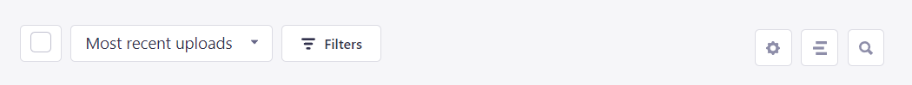

**Vamos explicar um pouco do que cada item deste painel faz:**

### Selecionar Tudo

Clicando aqui podemos selecionar todos os arquivos existentes na tela atual. Clicando novamente podemos remover todas as seleções.

Ao clicar, algumas opções aparecem em tela, sendo elas `Delete` (deletar) e `Move` (mover) os arquivos.

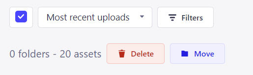

#### Deletar

Clicando em `Delete`, uma caixa se abrirá perguntando se você tem certeza de sua decisão.

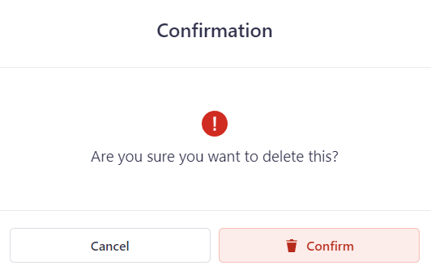

#### Mover

Clicando em `Move`, um novo modal se abre, perguntando para onde mover os arquivos selecionados.

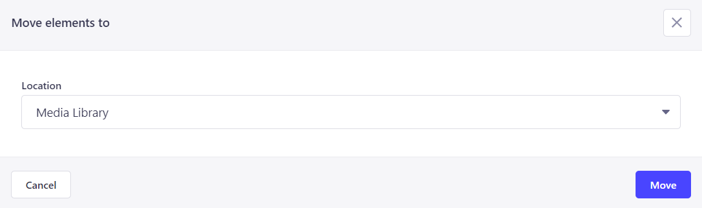

### Ordernar

Clicando aqui você pode escolher uma de várias opções de ordenação dos arquivos e escolher o que desejar.

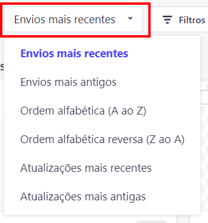

### Filtrar

Ao clicar em `Filters`, é possível criar novos filtros para a ordenação que vimos acima.

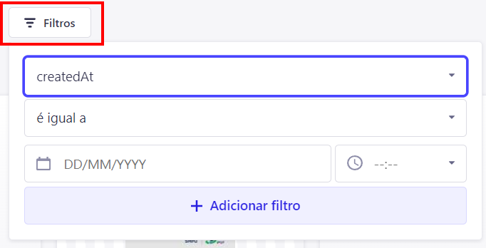

### Configurar visualização

Este botão têm a finalidade de ajustar a visão atual dos arquivos, ou seja, quantos arquivos aparecem por página e qual a ordenação padrão.

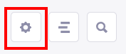

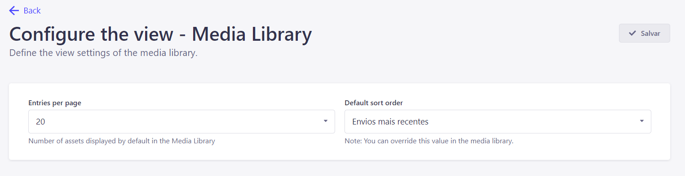

### Modo Lista / Grid

Este botão alterna entre a visão por Listas ou Grid, sendo Grid a padrão.

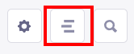

### Procurar

Este botão ao ser clicado se expande em uma barra de busca que pode ser utilizada para pesquisar dentro da biblioteca de mídia.

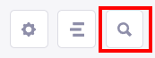

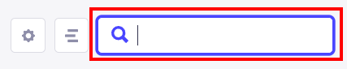